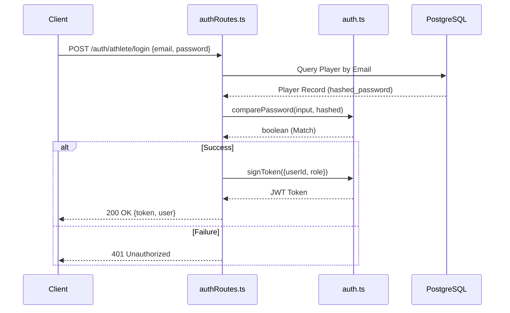
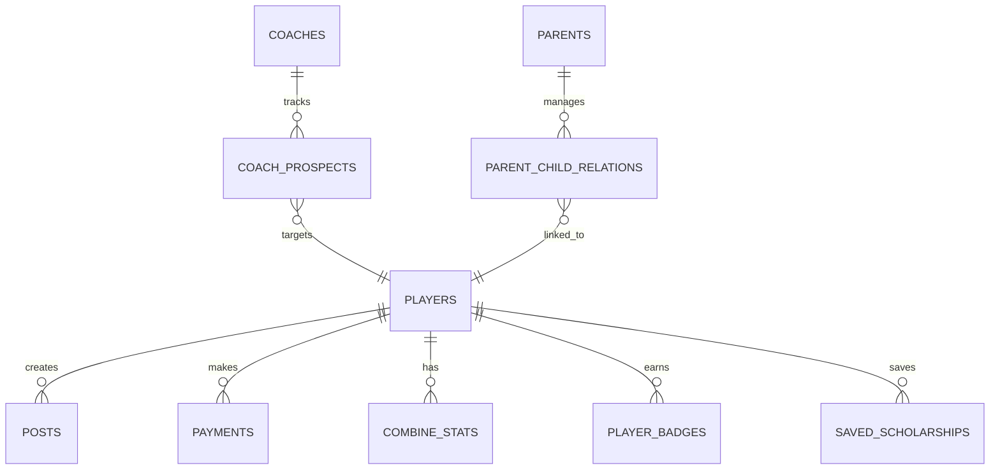

# H.E.R.S.365 Backend Architecture & Workflow

This document provides a technical overview of how the H.E.R.S.365 backend is organized, the flow of data, and its core integration points.

## 🏗️ High-Level System Architecture

The backend is built as a modular Express.js application using TypeScript, Drizzle ORM, and PostgreSQL.

```mermaid
graph TD
    Client[Web/Mobile Client] -->|API Requests| ExpressApp[Express Server (Node.js)]
    
    subgraph "Express Server"
        Middleware[Auth & Validation Middleware]
        Router[API Router]
        Controllers[Feature Route Handlers]
    end
    
    ExpressApp --> Middleware
    Middleware --> Router
    Router --> Controllers
    
    Controllers -->|Drizzle ORM| DB[(PostgreSQL)]
    
    subgraph "External Integrations"
        Stripe[Stripe Payments]
        AI[AI Matching/Feedback]
        MaxPreps[MaxPreps Data Scraper]
    end
    
    Controllers -.-> Stripe
    Controllers -.-> AI
    Controllers -.-> MaxPreps
```

---

## 🔄 Request Lifecycle (User Authentication Example)

This sequence shows how a typical request (like an Athlete Login) is handled by the system.



---

## 📂 Core Module Breakdown

| Module | Responsibilities | Key Routes |
| :--- | :--- | :--- |
| **Auth** | User registration, login, JWT signing, password hashing. | `/auth/athlete/login`, `/auth/coach/register` |
| **Coach** | Player discovery, recruiting boards, prospect tracking. | `/coach/players/search`, `/coach/board` |
| **Payments** | Stripe integration, subscriptions, transaction tracking. | `/payments/create-intent`, `/payments/webhook` |
| **NIL** | Deal matching, activity tracking, earnings dashboard. | `/api/nil/opportunities`, `/api/nil/applications` |
| **AI** | Performance analysis, bot interactions, match scoring. | `/api/ai/match`, `/api/bot/chat` |
| **Scholarship** | Scholarship database, tracking saved opportunities. | `/scholarships/list`, `/scholarships/save` |

---

## 📊 Database Entity Relationship (Core)

Mapping how the primary entities relate within the Drizzle schema.



---

## 🛡️ Security & Performance
- **Optimized Bcrypt**: Uses a 12-round salt for registration and fallback, with a "fast path" for production logins to handle high concurrency (50k+ users).
- **JWT Middleware**: Role-based access control (`requireAthlete`, `requireCoach`) ensures data privacy across Athlete, Coach, and Admin portals.
- **Drizzle ORM**: Provides type-safety and efficient SQL execution for complex sports analytics queries.
